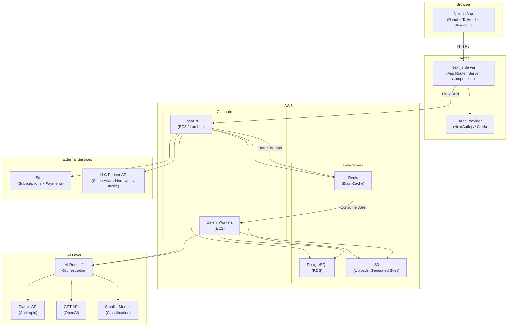
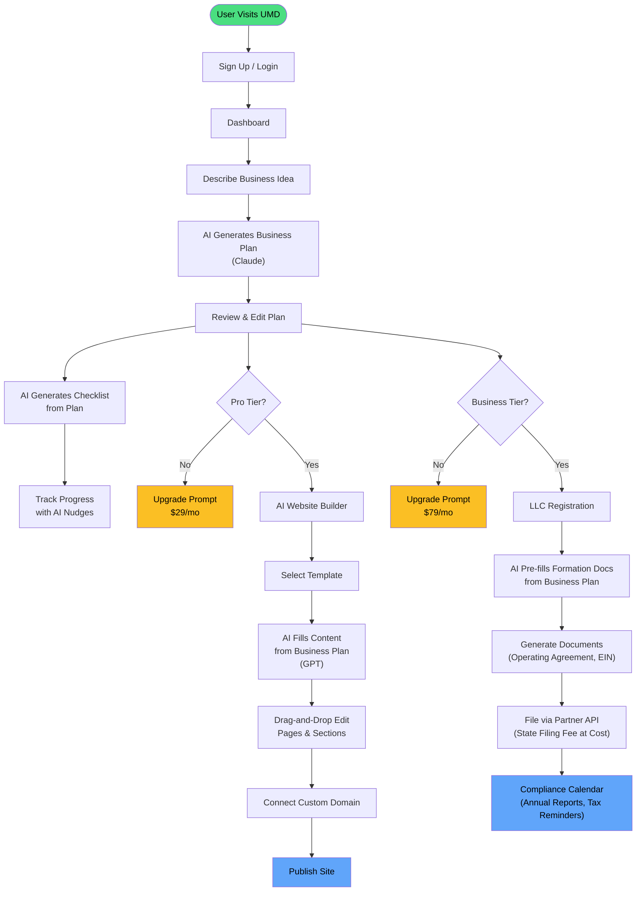
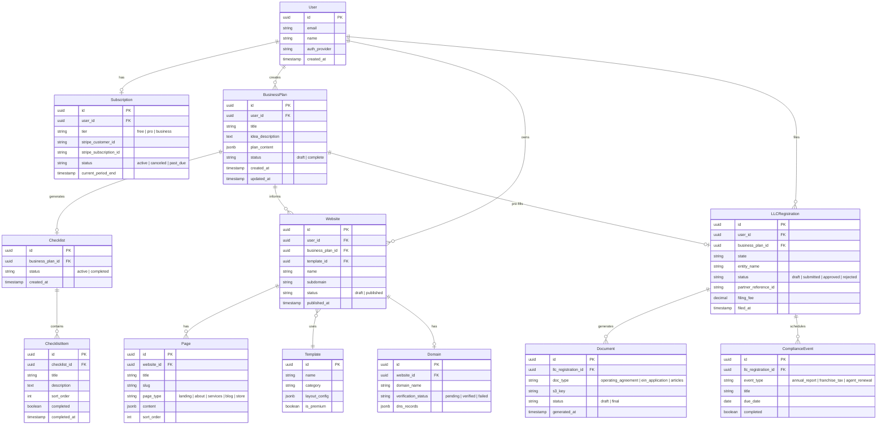

# Unlock My Dreams — Architecture Documentation

Visual documentation of UMD's system architecture, user flows, data model, and AI routing. All diagrams use [Mermaid](https://mermaid.js.org/) syntax and render on GitHub natively.

---

## 1. System Architecture

High-level view of all components, boundaries, and external services.

---

## 2. User Journey Flow

End-to-end user experience across all three products with tier gating.

---

## 3. Data Model (ER Diagram)

Core entities and their relationships.

---

## 4. AI Routing Diagram

How incoming AI tasks are classified and routed to the appropriate model.

```mermaid
flowchart LR
    REQ([AI Request]) --> ROUTER{AI Router}

    ROUTER -->|"Reasoning &<br/>Planning"| CLAUDE_TASKS
    ROUTER -->|"Content<br/>Generation"| GPT_TASKS
    ROUTER -->|"Quick<br/>Classification"| SMALL_TASKS

    subgraph CLAUDE_TASKS["Claude (Anthropic)"]
        C1[Business Plan Generation]
        C2[Checklist Creation & Adaptation]
        C3[LLC Document Reasoning]
        C4[Compliance Analysis]
    end

    subgraph GPT_TASKS["GPT (OpenAI)"]
        G1[Website Copy & Headlines]
        G2[Blog Post Generation]
        G3[SEO Meta Descriptions]
        G4[Product Descriptions]
    end

    subgraph SMALL_TASKS["Smaller / Faster Models"]
        S1[Business Type Classification]
        S2[State Requirement Extraction]
        S3[Sentiment & Intent Detection]
        S4[Content Moderation]
    end

    CLAUDE_TASKS --> CONTEXT[(Business Plan<br/>Context Store)]
    GPT_TASKS --> CONTEXT
    SMALL_TASKS --> PIPE

    subgraph PIPE["Prompt Pipeline (LangChain / Custom)"]
        P1[Context Injection]
        P2[Prompt Templates]
        P3[Output Parsing]
        P4[Quality Validation]
    end

    CONTEXT --> PIPE
    PIPE --> RESP([Response to User])

    style CLAUDE_TASKS fill:#d4a0ff,color:#000
    style GPT_TASKS fill:#a0d4ff,color:#000
    style SMALL_TASKS fill:#a0ffb8,color:#000
    style CONTEXT fill:#fff3b0,color:#000
```

---

## Diagram Rendering

These diagrams render natively on GitHub. For local viewing:

- **VS Code**: Install the [Markdown Preview Mermaid Support](https://marketplace.visualstudio.com/items?itemName=bierner.markdown-mermaid) extension
- **CLI**: Use `mmdc` from [mermaid-cli](https://github.com/mermaid-js/mermaid-cli) to export to PNG/SVG
- **Web**: Paste into [mermaid.live](https://mermaid.live) for interactive editing
